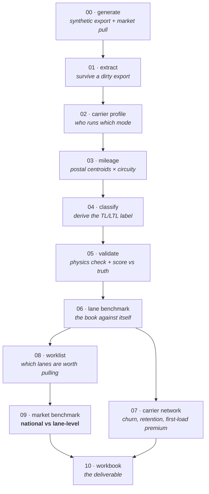

# Truckload Rate Benchmark

A freight analytics pipeline that answers one question — *are we overpaying our
carriers?* — and a worked example of getting that question badly wrong first.

The first pass of the real analysis found the book was buying **21% above market**,
around **$1.5M of annual overpay**, and pointed straight at the sourcing team. That
number was wrong. Re-run against lane-level market data, the same book was buying
**1.6% below** market, the genuine overpay was about **$36K**, and the actual
problem was on the sell side — lanes that bought *below* market and still lost
money, because nobody had repriced them in eight months.

This repo contains the pipeline, and it reproduces both answers so the gap between
them can be inspected rather than taken on faith.

> **Provenance.** This is a sanitized reconstruction of an analysis I ran on a
> freight brokerage's shipment history and a licensed market-rate subscription.
> Neither dataset can be published, so the repo ships a synthetic data generator
> instead — one that models the same book shape, the same data-quality failures,
> and the same rate structure. The method, the failure modes, and the conclusions
> are unchanged. All figures quoted from the demo are its real output; figures
> quoted from the engagement are labelled as such.

---

## The trap

A national spot average is free, immediate, and the obvious thing to reach for.
It is also the mean of a lane population that looks nothing like any one
brokerage's book, and that mismatch does not produce noise — it produces a large,
confident, specific number pointing in the wrong direction.

This book was concentrated into rural, low-backhaul destinations: places a carrier
reaches loaded and leaves empty. That deadhead is priced into the rate, it is
entirely legitimate, and it is enormous. In the real engagement, a 194-mile lane
into a rural destination cleared **$4.61/mile** against a **$2.41** national
average. Measured nationally that lane reads as **127% overpay**. Measured against
its own lane market it was about **5% above** — noise.

Running the demo reproduces the same inversion:

| | Benchmarked against | Result |
|---|---|---|
| Pass 1 | national spot average | **+25.6%**, $2,726,819 apparent overpay |
| Pass 2 | lane-level market rates | **−3.1%**, $442,406 *below* market |

And per lane, where the damage actually happens:

| Lane | Our cost | vs national | vs its own lane market | Error |
|---|---|---|---|---|
| Fort Wayne → Morgantown WV | $1,539 | **+98.0%** | −4.9% | 102.9 pts |
| Mansfield → Abingdon VA | $1,499 | **+97.1%** | −0.8% | 97.9 pts |
| Fort Wayne → Abingdon VA | $1,691 | **+82.2%** | −9.6% | 91.8 pts |

Every one is a rural destination. The error is not spread evenly across the book —
it lands hardest on exactly the lanes the book is most concentrated in, which is
what makes the wrong answer so convincing.

`tlbench/market.py` keeps `national_benchmark()` for this reason. It is not dead
code; it is the control.

### Two more ways the market data lies

Both are handled in `market.py`, and both silently corrupt an aggregate:

- **Match rate.** The provider reports how many of *our* loads it actually saw on
  a lane. In the real pull, one lane matched **7 of our 63 loads** and read as 12%
  above market. That lane was not 12% above market — it was *unmeasured*, and
  acting on it would have meant repricing on the strength of seven observations.
  Lanes under a 60% match are graded `unmeasured` rather than folded in.
- **Silent market-pair aggregation.** When a lane is too thin to price, the
  provider quietly answers with the surrounding market-to-market average — same
  presentation, no flag. Two distinct lanes come back with byte-identical rate,
  report count, and mileage. Summed alongside each other, that double-counts.

### Robustness

A finding that only holds on the full set is an artifact of whatever the weakest
lanes contributed. The headline is re-run under progressively stricter subsets,
and it has to survive all of them:

```
                cut  lanes  loads         spend     at_market    variance  variance_pct
 all verified lanes    107   6097 13,842,820.78 14,285,227.00 -442,406.22         -3.10
market-pair deduped    106   6075 13,776,234.98 14,171,553.00 -395,318.02         -2.79
      measured only    105   6023 13,788,411.30 14,232,779.00 -444,367.70         -3.12
```

The national-average result does not survive contact with lane-level data at all.
That is the test it failed.

---

## The other problem: the mode column is unusable

Before any of this can run, the pipeline has to know which loads are truckload.
The TMS has a `mode` field for exactly this. It cannot be used.

In the real export it labelled a carrier running seven-figure truckload volume as
"LTL" on 96% of its loads, and the reverse error was just as common — a "TL-Any"
bucket sweeping up miscoded partials that priced under a dollar a mile on
2,000-mile hauls. Mode is entered by whoever builds the load and nothing
downstream ever validates it.

In the demo, the TMS calls **404** loads truckload. The derivation finds **8,696**.

So the label is derived instead, from two anchors that can be trusted on their own
terms plus a boundary learned from where they separate:

- **Anchor LTL** — loads tendered to a carrier that operates an LTL terminal
  network. Those companies do not haul full truckloads for a brokerage; carrier
  identity settles it.
- **Anchor TL** — loads on equipment only a truckload carrier provides. Nothing
  moves LTL on a lowboy or a Conestoga.
- **The ambiguous middle** — dry van on a carrier that runs both — is separated on
  `(cost, miles)`, which is what physically distinguishes the modes. LTL is priced
  off class and weight and saturates with distance; truckload is priced off
  distance and capacity.

The boundary is fitted per distance band as the **geometric** midpoint between the
LTL 90th percentile and the truckload 10th percentile, then smoothed to a line.
Geometric, not arithmetic: cost is roughly log-distributed, so an arithmetic
midpoint of a $600 LTL ceiling and a $2,400 truckload floor sits far too close to
the truckload side and sweeps heavy LTL into the benchmark.

Every load carries the rule that decided it (`mode_basis`), so the portion of the
result resting on inference rather than evidence is auditable — and quotable, when
someone asks how much of this is a guess.

### It is measured, not asserted

A real export has no answer key. That absence is the entire reason the derivation
exists — and it also means the classifier can never be scored on real data. So the
synthetic generator plants ground truth, and stage 05 scores against it:

```
accuracy              : 0.929
truckload precision   : 0.890
truckload recall      : 0.950
```

### The confidence gate, and why an absolute floor is not enough

A load labelled truckload that prices below any plausible truckload floor is
probably a partial or volume LTL the boundary swept up. Including it would drag
every lane average down and manufacture a finding that we buy below market — so
the gate fails toward exclusion.

The obvious implementation is an absolute floor: $1.20/mile on long haul, more on
short. That is necessary and not sufficient, and the gap only becomes visible on a
concentrated book. On a lane whose own market clears **$4.00/mile**, a partial
moving at **$2.00/mile** is unmistakably not a full truckload — and it clears the
$1.60 floor comfortably. *Exactly the lanes the benchmark cares most about are the
ones where an absolute floor stops protecting it.*

So a load must also clear a fraction of its own lane's median rate per mile. The
median, not the mean: the population being measured is the contaminated one, and a
median tolerates the contamination it is being used to detect.

Measured against ground truth, the gate is worth having:

| | Loads | Genuinely truckload |
|---|---|---|
| All derived truckload | 8,696 | 89.0% |
| High confidence only | 8,099 | **95.6%** |
| Held out | 597 | 0% — every one is genuinely LTL |

---

## The pipeline



Stages hand off through CSVs in `data/` rather than through memory, so an
expensive early stage does not re-run while a later one is being iterated on.

**Stage 06 is deliberately before any market data is bought.** On a lane where we
buy repeatedly from several carriers, the 25th percentile is a price we have
already paid, on this lane, inside the window. The gap to it is recoverable
without knowing anything about the wider market — and it *cannot be wrong about
the market, because it never refers to one.* In the demo that finds **$1.47M**
across 119 lanes before a single external rate is looked up.

---

## What the analysis concluded

Buy-side sourcing was fine. The margin problem was on the sell side, and it was
invisible to every buy-side metric.

Committed lanes are repriced once and then left, while the buy side keeps tracking
the market every week. In a rising market the margin bleeds away a point at a
time, and no individual month looks alarming enough to escalate. In the real
engagement one lane bought **12.6% under** market and still ran **−11.3%** margin;
the sell rate had not moved in eight months.

Whole-window margin hides this completely — it averages a healthy first half
against an underwater second half and reports something unremarkable. So
`sell_side_view()` compares recent months against everything prior and flags lanes
that buy *at or below* market and are *still* losing margin. No amount of carrier
negotiation fixes those.

The demo flags 5 such lanes. The largest carries 262 loads, buys **9.6% below**
market, and has watched margin fall from 17.4% to 11.2%.

Sourcing and pricing are usually owned by different people. That is how a lane
bleeds a point of margin a month for most of a year without either of them
escalating it.

---

## Running it

No credentials, no subscription, and no network — the demo resolves distances from
a bundled centroid table in `data/reference/`.

```bash
pip install -r requirements.txt
python run_pipeline.py          # generate synthetic data, run all 11 stages
python -m pytest -q             # 166 tests, all offline
```

Individual stages, since the interesting one is 09:

```bash
python run_pipeline.py --only 09
python run_pipeline.py --from 04    # resume from the classifier
```

### Against a real export

Point stage 01 at a workbook and skip stage 00. Everything downstream is
identical — the demo exercises the real code path rather than a special case.

```bash
export TLBENCH_SOURCE_EXPORT="/path/to/export.xlsx"
export TLBENCH_SOURCE_HEADER_ROW=2      # banner rows above the real header
export TLBENCH_WINDOW_START=2025-04-01  # complete months only
python run_pipeline.py --from 01
```

Drop a market pull at `data/market_pull.csv` with columns `lane`,
`provider_miles`, `market_rate`, `market_rate_90d`, `provider_reports_total`,
`provider_reports_ours`. Without one, stage 09 runs the national comparison only —
which, per everything above, is not an answer.

Install `pgeocode` to resolve postal codes outside the demo geography.

---

## What the export throws at you

Every one of these broke a naive read of the real file, and each has a test
pinning the fix. The generator reproduces all of them:

| Failure | Why it matters |
|---|---|
| Dates mixed between Excel serials and epoch integers in one column | Parsing with one unit silently destroys the other group |
| Header rows repeated inside the data block | Survive `read_excel` as data and poison every numeric aggregate |
| Zips degraded to floats by a spreadsheet round-trip | `04769` → `4769` geocodes nowhere; those loads vanish without appearing in a count |
| `mode` column near-useless | Misroutes 80%+ of carrier spend |
| Weight populated on ~11% of truckload loads | Tempting as a discriminator, unusable in practice |
| Origin city equals destination city on ~5% of loads | Rate per mile is undefined; needs a floor, not a filter |
| Cross-border lane points | Unresolvable by US postal data, and unpriceable by the market provider |

---

## Layout

```
tlbench/            importable analysis logic — side-effect free, fully tested
  coerce.py         dirty-export coercions
  geo.py            centroid resolution and distance estimation
  classify.py       the TL/LTL derivation
  lanes.py          lane aggregation and the internal benchmark
  market.py         national vs lane-level benchmarking, and the trap
  network.py        carrier churn, retention, first-load premium
  synth.py          synthetic generator with ground truth
  workbook.py       deliverable assembly
stages/             thin numbered scripts, one per pipeline step
tests/              166 offline tests
docs/METHOD.md      method notes and the gotcha list
data/reference/     bundled postal centroids so the demo runs offline
```

---

## Limitations

Stated because they bound what the result means.

- **The long tail cannot be benchmarked.** Lanes with too little repeat volume
  have no meaningful percentile and no reliable market rate. In the demo, 95% of
  truckload spend is pullable; on the real book a large share of lanes averaged
  one load each and could not be benchmarked by this method or by any rate
  service. That size is reported rather than averaged in.
- **Cost per mile depends on estimated distance.** Postal-centroid great-circle
  distance times a circuity factor runs a few percent short of real road miles.
  Stage 09 measures the bias against the provider's own mileage and prefers the
  provider's number wherever it exists, but lanes outside the pull keep the
  estimate.
- **The classifier is scored on synthetic data only.** 0.929 accuracy is against
  a generator whose ambiguous middle I designed. It says the method works on
  freight shaped like this; it is not a guarantee about a different book.
- **Spot, not contract.** The comparison assumes lanes are not under contracted
  rates. Market providers publish spot all-in and contract linehaul-only; mixing
  them without adding fuel surcharge back is its own way to be confidently wrong.

## License

MIT
